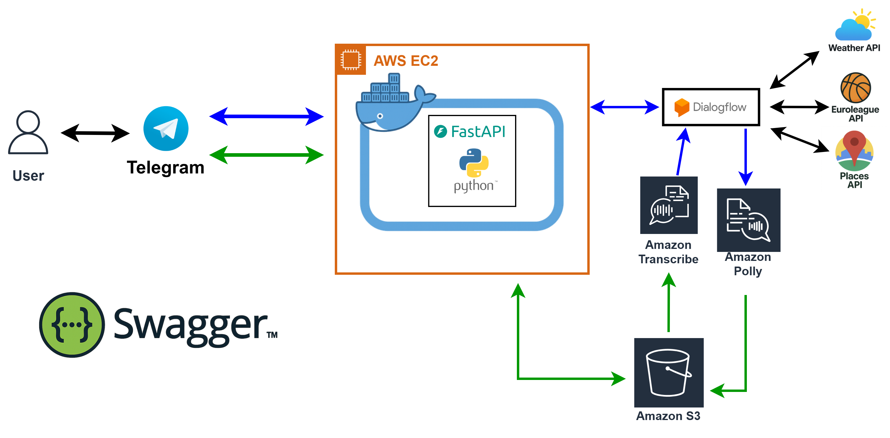

# Euroleague Traveler Bot

**Plan your EuroLeague trip in one chat.**  
A Telegram bot that blends live Euroleague basketball data, hyper‑local weather forecasts and Google Places travel tips – with both **text and voice** commands.

<p align="center">
  
</p>

[](https://www.python.org/) 
[](https://docs.docker.com/) 
[](#-license--author)

---

## 📑 Table of Contents
1. [Demo](#-demo)
2. [Key Features](#-key-features)
3. [Architecture](#-architecture)
4. [Quick Start (Local)](#-quick-start-local)
5. [Production Deployment (AWS)](#-production-deployment-aws)
6. [Configuration](#️-configuration)
7. [Usage Examples](#-usage-examples)
8. [API Reference](#-api-reference-swagger)
9. [Testing](#-running-tests)
10. [Contributing](#-contributing)
11. [License & Author](#-license--author)
12. [Credits](#-credits)

## 🎬 Demo
<p align="center">
  
</p>

---

## ✨ Key Features
- **Euroleague Results** – last/next game or full-season summary for any team  
- **Weather** – current, hourly, tomorrow, or multi‑day forecasts for any city  
- **Places of Interest** – cafés, parks, museums via Google Places  
- **Text & Voice** – voice queries transcribed by AWS Transcribe, answers can return as audio via AWS Polly  
- **Cloud‑Powered AI** – Dialogflow for intent detection; multiple external APIs for real‑time data

---

## 🏗️ Architecture
<p align="center">
  
</p>

1. **Telegram** → **FastAPI** (Docker) – handles webhook  
2. **FastAPI** → **Dialogflow** – detects intent (`weather`, `euroleague`, `places`)  
3. **FastAPI** → External APIs (OpenWeatherMap, Euroleague, Google Places)  
4. _(Voice only)_ Telegram OGG → **S3** → **AWS Transcribe** → text  
5. Response text → **AWS Polly** → MP3 back to Telegram

---

## ⚡ Quick Start (Local)
```bash
# 1) Clone
git clone https://github.com/<YOUR-GH-USER>/<REPO>.git
cd <REPO>

# 2) Create virtual‑env & install deps
python -m venv .venv && source .venv/bin/activate
pip install -r requirements.txt

# 3) Copy the sample config and fill in your keys
cp config.json config.local.json
nano config.local.json

# 4) Run
uvicorn main:app --reload           # http://127.0.0.1:8000/docs
```

---

## ☁️ Production Deployment (AWS)
The fastest path is **Docker on EC2** (you can later add API Gateway or CloudFront if you want a fully‑managed front door).

### 1. Launch EC2 instance
| Step | Details |
|------|---------|
| **AMI** | Amazon Linux 2023 |
| **Size** | `t3.medium` (or larger if Transcribe traffic is heavy) |
| **Ports** | 22 (SSH), 80 / 443 (HTTP/S), 8000 (optional direct) |
| **Tags** | `Name = euroleague-bot` |

```bash
# basic setup once connected
sudo yum update -y && sudo yum install git docker -y
sudo service docker start
sudo usermod -aG docker ec2-user   # logout/login once
```

### 2. Clone & Build image
```bash
git clone https://github.com/<YOUR-GH-USER>/<REPO>.git && cd <REPO>
cp config.json config.production.json   # fill in all real secrets!
sudo docker build -t euroleague-bot .
sudo docker run -d --restart=always --name euroleague-bot \
  -p 8000:8000 \
  -v $(pwd)/config.production.json:/app/config.json:ro \
  euroleague-bot
```

### 3. (Optional) Nginx reverse‑proxy with HTTPS
```bash
sudo amazon-linux-extras install nginx1
sudo nano /etc/nginx/conf.d/bot.conf       # proxy_pass http://127.0.0.1:8000;
sudo systemctl enable nginx && sudo systemctl restart nginx

# Let’s Encrypt
sudo yum install -y certbot python3-certbot-nginx
sudo certbot --nginx -d api.<YOUR-DOMAIN>
```

### 4. Telegram Webhook
```bash
curl "https://api.telegram.org/bot<TELEGRAM_TOKEN>/setWebhook?url=https://api.<YOUR-DOMAIN>/bot-webhook"
```

### 5. (Optional) API Gateway + CloudFront front door
1. Create **HTTP API** in API Gateway → Integration URL = `https://api.<YOUR-DOMAIN>`  
2. Route `ANY /{proxy+}` → **Invoke URL** → use that for your Telegram webhook.  
3. Attach **CloudFront** for global edge caching if desired.

<details>
  <summary>Why use API Gateway?</summary>

  * Gives you a stable URL even if you redeploy EC2.  
  * Built‑in rate‑limiting & WAF integration.  
  * Easy future move to AWS Lambda.
</details>

---

## ⚙️ Configuration
`config.json` (or `config.<env>.json`) is mounted inside the container. Example:  

```jsonc
{
  "TELEGRAM_TOKEN": "<TOKEN>",
  "OPENWEATHERMAP_API_KEY": "<KEY>",
  "S3_BUCKET_NAME": "<BUCKET>",
  "S3_REGION": "eu-central-1",
  "AWS_ACCESS_KEY_ID": "<ID>",
  "AWS_SECRET_ACCESS_KEY": "<SECRET>",
  "AWS_REGION": "eu-central-1",
  "DIALOGFLOW_PROJECT_ID": "<PROJECT>",
  "GOOGLE_PLACES_API_KEY": "<KEY>"
}
```

**Tip:** store secrets in **AWS SSM Parameter Store** or **Secrets Manager**, then load at startup.

---

## 💡 Usage Examples

| Type  | Example Query | Result |
|-------|---------------|--------|
| Text  | `What is the weather in Paris tomorrow?` | Sends tomorrow’s forecast |
| Text  | `Show me the latest results for Real Madrid.` | Last Euroleague score |
| Voice | 🎤 “Give me some nice parks in Madrid” | List of parks + spoken reply |

---

## 🔌 API Reference (Swagger)
Once running, open **`/docs`** (e.g. `http://localhost:8000/docs`).

| Endpoint | Description |
|----------|-------------|
| **POST /bot-webhook** | Telegram webhook |
| **GET  /test/weather** | Quick weather check |
| **GET  /test/euroleague** | Euroleague helper |
| **GET  /test/places** | Places helper |

---

## 🧪 Running Tests
```bash
pip install -r requirements.txt
pytest -q
```


---

## 📜 License & Author
Released under the MIT License.  

**Author:** Amit Persky – GitHub [@Amit-Persky](https://github.com/Amit-Persky)

---

## 🙏 Credits
Euroleague API • OpenWeatherMap • Google Places • Google Dialogflow •  
AWS (S3, Transcribe, Polly) • Python 3.12 • FastAPI • Docker
