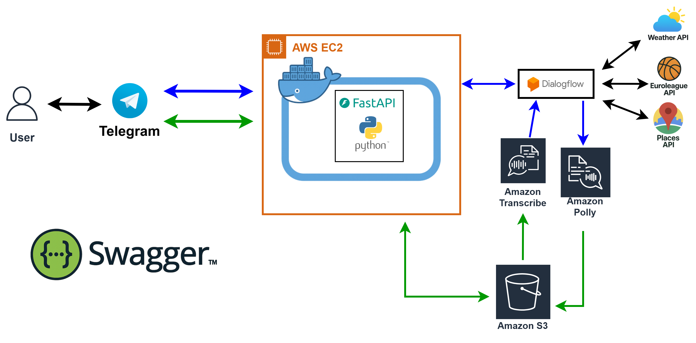

# Euroleague Traveler Bot

> A Telegram chatbot that combines **Euroleague basketball results**, **weather forecasts**, and **travel tips** (restaurants, parks, museums) – with both text **and voice** support.

<p align="center">
  
</p>

---

## 🎬 Demo

<p align="center">
  <video width="480" controls>
    <source
      src="https://raw.githubusercontent.com/Amit-Persky/Amit-bot/main/media/demo.mp4"
      type="video/mp4">
    Your browser does not support the video tag.
    <br>
    <a href="media/demo.mp4">Download the demo</a>
  </video>
</p>

---

## ✨ Key Features
- **Euroleague Results** – last / next game, or full-season summary for any team  
- **Weather** – current, hourly, tomorrow, or multi-day forecasts for any city  
- **Places of Interest** – top cafés, parks, museums, etc. via Google Places  
- **Text & Voice** – voice queries transcribed by AWS Transcribe, replies can return as audio via AWS Polly  
- **Cloud-Powered AI** – Google Dialogflow for intent detection; AWS + 3rd-party APIs for real-time data  

---

## 🏗️ Architecture
<p align="center">
  
</p>

1. Telegram ⟶ **FastAPI** (Docker) – handles webhook  
2. FastAPI ⟶ **Dialogflow** – detects intent (`weather`, `euroleague`, `places`)  
3. FastAPI ⟶ external APIs (OpenWeatherMap, Euroleague, Google Places)  
4. _(Voice only)_ Telegram OGG ⟶ **S3** ⟶ **AWS Transcribe** ⟶ text  
5. Response text ⟶ **AWS Polly** ⟶ MP3 back to Telegram  

---

## 🚀 Installation & Deployment

### Prerequisites
| Service | What you need |
|---------|---------------|
| Telegram | Bot token from **@BotFather** |
| OpenWeatherMap | API key |
| Google Cloud | Dialogflow project, service-account JSON, Google Places API key |
| AWS | Access Key ID + Secret, **S3** bucket (audio), **Polly** & **Transcribe** enabled |
| Docker | Docker Engine running on your server / EC2 |

### Configuration (`config.json`)
```json
{
  "TELEGRAM_TOKEN": "<YOUR_TELEGRAM_TOKEN>",
  "OPENWEATHERMAP_API_KEY": "<YOUR_OPENWEATHERMAP_API_KEY>",
  "S3_BUCKET_NAME": "<YOUR_S3_BUCKET_NAME>",
  "S3_REGION": "<YOUR_S3_REGION>",
  "AWS_ACCESS_KEY_ID": "<YOUR_AWS_ACCESS_KEY_ID>",
  "AWS_SECRET_ACCESS_KEY": "<YOUR_AWS_SECRET_ACCESS_KEY>",
  "AWS_REGION": "<YOUR_AWS_REGION>",
  "DIALOGFLOW_PROJECT_ID": "<YOUR_DIALOGFLOW_PROJECT_ID>",
  "GOOGLE_PLACES_API_KEY": "<YOUR_GOOGLE_PLACES_API_KEY>"
}
```
> **Important:** the bot will not run with the placeholder values.

### Build & Run with Docker
```bash
sudo service docker start              # if Docker isn't running
sudo docker build -t your_bot_image .
sudo docker run -d --name your_bot_container -p 8000:8000 your_bot_image
```

Set your webhook (replace token + domain):
```bash
curl "https://api.telegram.org/bot<YOUR_TELEGRAM_TOKEN>/setWebhook?url=https://<YOUR_DOMAIN>/bot-webhook"
```

---

## 💡 Usage Examples

| Type  | Example Query | What Happens |
|-------|---------------|--------------|
| Text  | `What is the weather in Paris tomorrow?` | Returns tomorrow’s forecast for Paris |
| Text  | `Show me the latest results for Real Madrid.` | Sends last Euroleague score |
| Voice | 🎤 “Give me some nice parks in Madrid” | Transcribes audio, fetches parks list, replies with audio |

---

## 🔌 API Reference (Swagger)

Once the server is running, open **`/docs`** (e.g. http://localhost:8000/docs)

| Endpoint | Description |
|----------|-------------|
| **GET /test/weather** | Quick weather checks |
| **GET /test/euroleague** | Euroleague queries |
| **GET /test/places** | Place recommendations |

---

## 🧪 Running Tests
The repo contains a full **Pytest** suite (`tests/`).  
Run locally:

```bash
pip install -r requirements.txt
pytest
```

---

## 📜 License & Author
Released as open-source – feel free to fork, modify, and deploy!  

**Author:** Amit (GitHub [@Amit-Persky](https://github.com/Amit-Persky))

---

## 🙏 Credits
Euroleague API • OpenWeatherMap API • Google Places • Google Dialogflow •  
AWS (S3, Transcribe, Polly) • Python 3 + FastAPI • Docker
